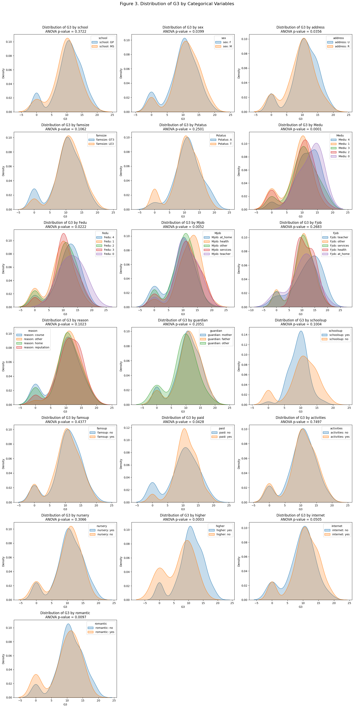

This project aims to predict students’ academic performance based on their background attributes using various machine learning models, including Linear Regression, Random Forest, Multi-Layer Perceptron (MLP), XGBoost, and a Voting ensemble. Dataset is from Kaggle, [Student Performance Dataset](https://www.kaggle.com/datasets/devansodariya/student-performance-data/data). The work is divided into two primary stages: Exploratory Data Analysis (EDA) and Model Development.

## Exploratory Data Analysis
*   **Programming Concepts** 
    The `prepare_data` class is designed for managing and preprocessing educational datasets in preparation for machine learning tasks. It handles column categorization, data cleaning, encoding, statistical analysis, and visualization.
*   **Main Discoveries**
    1. There are no duplicated or missing data in the dataset.
    2. Students who spend more time studying and less time hanging out with friends tend to have higher average G3 grades, as shown in Figure 2.
    3. Statistical analysis using Kernel Density Estimation (KDE), ANOVA, and Tukey HSD tests indicates that **parental background, student aspirations, and living environment** significantly affect students' final grades (p-value < 0.05), as shown in Figure 3. Key insights include:
      - Parental Education Level: Students whose parents have the lowest education level (rank 1) score significantly lower in G3 compared to those whose parents have the highest level (rank 4).
      - Parental Occupation: Students whose mothers are homemakers ("at_home") tend to perform worse than those whose mothers work in the health sector.
      - Student Intentions: Those planning to pursue higher education generally perform better.
      - Living Environment: Urban-living students typically achieve higher average G3 grades than their rural counterparts.

    4. As shown in Figure 4, early academic performance (G1 and G2) is highly predictive of final grades (G3). Conversely, students with more past academic failures tend to perform worse.

*   **Data Preprocessing**  
    Based on the above analysis, the data does not contain any counterintuitive patterns and is complete. Therefore, only the following two types of variables are transformed:
    1. Nominal Variables: One-Hot Encoding was used.
    2. Numerical Variables: Variables with high skewness (specifically failures and absences) were scaled using `RobustScaler()`. All other numerical features were standardized using `StandardScaler()`.

## Model Training
To compare the performance of four regression models and a voting ensemble for predicting a continuous variable, using GridSearchCV for hyperparameter tuning and mean squared error (MSE) as the evaluation metric.

**Cross-Validation Results**  
Using 5-fold cross-validation:
1. XGBRegressor achieved the lowest mean test MSE (≈ 2.01), indicating the best generalization performance.
2. The Voting Ensemble combines the strengths of individual models, but in this case, it did not outperform XGBRegressor alone.

**Final Model Evaluation**  
Based on cross-validation results, XGBRegressor was selected as the final model. It demonstrated strong predictive accuracy on the test set, with an MSE of 4.04, a Root Mean Squared Error (RMSE) of 2.01, and an R² score of 0.80, indicating a good model fit.
